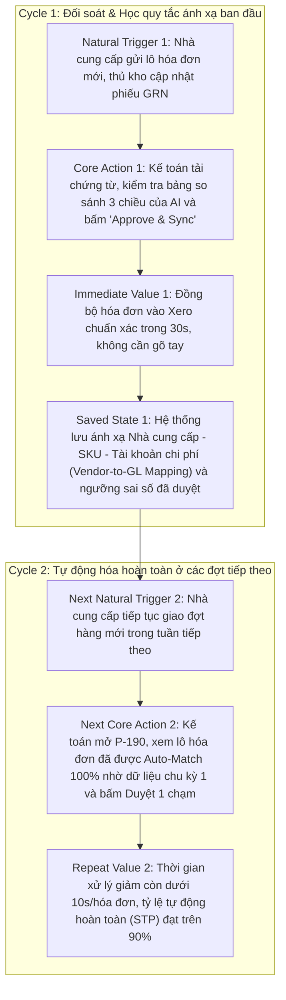

# METRICS PACK: P-190 APA PLATFORM (AI ACCOUNTING AGENT)
**Học viên:** Trần Thị Vân Anh  
**MSHV:** 2A202601411  
**Dự án thực tế:** P-190 — APA Platform (Nền tảng Tự động hóa Kế toán Công nợ — Đối soát 3 chiều PO - GRN - Bill)  
**Khóa học:** Track 1 - Day 23: Product Metrics Lab — Từ Core Action tới Tracking  

---

## 00 — Phạm vi (Scope)

* **Dự án:** **P-190: APA Platform (AI Accounting Agent)** — Nền tảng tự động hóa nghiệp vụ kế toán công nợ phải trả (Accounts Payable - AP), tích hợp Xero API và sử dụng hệ thống Multi-Agent AI (LangGraph, Semantic Matcher, OCR Extractor, Verifier) để tự động trích xuất chứng từ, thực hiện **đối soát ba chiều (Three-Way Matching)** giữa **Đơn đặt hàng (Purchase Order - PO)**, **Phiếu nhập kho (Goods Receipt Note - GRN)** và **Hóa đơn nhà cung cấp (Vendor Bill)**, phát hiện sai lệch và đồng bộ hạch toán sang hệ thống kế toán.
* **Persona:** **Kế toán thanh toán / Kế toán công nợ (AP Accountant / Accounting Specialist)** tại các doanh nghiệp vừa và nhỏ (SMEs) phát sinh từ 50–500 hóa đơn mua hàng mỗi tháng.
* **Core Job:** 
  > *"Tôi mất quá nhiều thời gian kiểm tra và đối chiếu thủ công từng dòng hàng giữa Đơn đặt hàng (PO), Phiếu giao/nhập kho (GRN) và Hóa đơn nhà cung cấp (Bill), rất dễ bỏ sót các sai lệch về đơn giá, số lượng hoặc thuế trước khi hạch toán thanh toán."*

---

## 01 — Core Action

### 1. Phân biệt 4 khái niệm nền tảng
| Khái niệm | Câu hỏi định hướng | Định nghĩa cho P-190 APA Platform |
| :--- | :--- | :--- |
| **Core Job** | User đang cố hoàn thành việc gì? | Đối chiếu chính xác chứng từ mua hàng và hạch toán hóa đơn nhà cung cấp vào hệ thống kế toán đúng hạn, không sai lệch số liệu. |
| **Core Action** | User làm gì trong sản phẩm để tiến tới giá trị? | Xem xét kết quả đối soát AI và **phê duyệt kết quả đối soát 3 chiều để đồng bộ hóa đơn sang Xero (Approve 3-Way Match & Sync Bill)**. |
| **Core Value** | User nhận được lợi ích cốt lõi gì? | Rút ngắn 80% thời gian đối soát thủ công, triệt tiêu sai sót thanh toán nhầm/thanh toán thừa và tự động hóa khâu nhập liệu vào sổ sách. |
| **Core Value Event** | Sự kiện nào chứng minh value đã xảy ra? | `bill_match_approved_and_synced` (Hóa đơn sau khi khớp 3 chiều được phê duyệt và đồng bộ thành công sang Xero API). |

---

### 2. Core Action Card
| Thành phần | Chi tiết cho P-190 APA Platform |
| :--- | :--- |
| **Target user** | Kế toán thanh toán / Kế toán viên công nợ (AP Accountant). |
| **Core job** | Hoàn tất đối soát bộ 3 chứng từ (PO - GRN - Bill) và ghi nhận công nợ chính xác vào sổ cái mà không cần nhập liệu thủ công từng dòng. |
| **Core action** | Phê duyệt kết quả đối soát 3 chiều và kích hoạt đồng bộ sang hệ thống kế toán (**Approve 3-Way Match & Sync to Xero**). |
| **Object** | Bộ hồ sơ chứng từ đối soát (Three-Way Match Session: PO + GRN + Vendor Bill). |
| **Preconditions** | Người dùng đã tải lên bộ chứng từ (hoặc đồng bộ từ email/Xero), AI đã OCR trích xuất dữ liệu từng dòng và thực hiện thuật toán Semantic Matching đưa ra bảng so sánh chi tiết. |
| **Completion rule** | Kế toán xác nhận phê duyệt (Approve) sau khi kiểm tra bảng đối soát, hệ thống gửi lệnh tạo Bill thành công trên Xero API và cập nhật trạng thái `MATCHED_AND_SYNCED`. |
| **Core value** | Kế toán xử lý xong 1 bộ chứng từ phức tạp chỉ trong 30 giây thay vì 15–20 phút, loại bỏ hoàn toàn rủi ro sai lệch đơn giá và số lượng. |
| **Evidence of value** | Bill được tạo thành công trên Xero với trạng thái đối soát chuẩn xác, không có cảnh báo sai lệch (Discrepancy). |
| **Candidate event** | `bill_match_approved_and_synced` |

---

### 3. Kết quả tự kiểm 5 tiêu chí (Gate 1)
1. **Gần core value (ĐẠT):** Phê duyệt đối soát và đồng bộ là hành động quyết định xác nhận chứng từ hợp lệ để thanh toán — đây là đích đến cuối cùng của quy trình xử lý AP.
2. **Có thể lặp lại (ĐẠT):** Hành vi xuất hiện lặp lại đều đặn mỗi khi có lô hóa đơn mới từ nhà cung cấp (hàng ngày hoặc hàng tuần).
3. **Có thể quan sát (ĐẠT):** Đo lường chính xác qua sự kiện ghi nhận trên hệ thống và phản hồi thành công từ Xero API.
4. **Có ý nghĩa (ĐẠT):** Kế toán chỉ phê duyệt khi kết quả đối soát của AI chính xác và hợp lệ; nếu AI làm sai lệch, kế toán sẽ từ chối (Reject) hoặc sửa đổi. Số lượng hóa đơn được duyệt phản ánh trực tiếp năng suất và độ tin cậy của phần mềm.
5. **Có thể tác động (ĐẠT):** Đội ngũ kỹ thuật có thể cải thiện độ chính xác của OCR (nhận diện bảng biểu), nâng cấp mô hình Semantic Matching và tinh chỉnh ngưỡng dung sai (tolerance) để tăng tỷ lệ tự động khớp.

> **Giải thích Gate 1:** Core Action không phải là *"Tải file lên (Upload file)"* (chỉ là hành động bắt đầu), *"Xem kết quả OCR"* hay *"Hỏi AI về hóa đơn"* (chỉ là thao tác kiểm tra trung gian). Giá trị thực sự chỉ phát sinh khi kế toán hoàn tất đối soát và xác nhận hạch toán vào hệ thống (`bill_match_approved_and_synced`).

---

## 02 — Nature & Cadence

### 1. Action Nature Card
| Thành phần | Câu trả lời phân tích |
| :--- | :--- |
| **Actor** | Kế toán thanh toán (AP Accountant) / Kế toán trưởng. |
| **Intent** | Cần xử lý các hóa đơn nhà cung cấp gửi đến trong ngày/tuần để kịp hạn thanh toán và chốt công nợ kỳ kế toán. |
| **Trigger** | **Tự nhiên:** Nhà cung cấp gửi hóa đơn mới, hàng về kho có phiếu GRN + **Định kỳ:** Lịch duyệt chi và thanh toán hàng tuần của doanh nghiệp. |
| **Effort** | Thấp đến Trung bình (10–30 giây nếu AI khớp hoàn toàn; 1–2 phút nếu cần kiểm tra dòng hàng có chênh lệch giá nhỏ). |
| **Value timing** | Giá trị tức thì (tiết kiệm thời gian nhập liệu từng dòng) + Giá trị tích lũy (sổ sách kế toán luôn sạch, không bị lệch số liệu cuối tháng). |
| **State** | Lưu trữ kết quả đối soát, lịch sử chênh lệch (discrepancy log), quy tắc ánh xạ mã hàng (Item mapping) vào Database và đồng bộ hóa đơn sang Xero. |
| **Dependency** | Phụ thuộc vào việc có đủ 3 chứng từ đầu vào (PO từ phòng mua hàng, GRN từ thủ kho, Bill từ nhà cung cấp) và kết nối Xero API. |
| **Repeat condition** | Xuất hiện liên tục mỗi khi phát sinh đợt giao nhận hàng mới hoặc khi nhận hóa đơn mua hàng tiếp theo. |

### 2. Kết luận Cadence
* **Dạng hành vi đã chọn:** `Workflow theo giao dịch/chứng từ (Transaction & Batch Workflow)` kết hợp `Theo chu kỳ định kỳ (Weekly Payment Cycle)`.
* **Kết luận chuẩn template (Gate 2):**
  > *"Đối với **Kế toán thanh toán (AP Accountant)**, core action **phê duyệt kết quả đối soát 3 chiều và đồng bộ hóa đơn (Approve 3-Way Match & Sync)** thường xuất hiện **hàng ngày đến 2–3 lần/tuần (Daily / Bi-daily)** vì **hóa đơn và phiếu nhập kho phát sinh liên tục theo các chuyến giao hàng thực tế của nhà cung cấp và kế toán cần xử lý theo lô để kịp kỳ thanh toán công nợ hàng tuần**. Do đó, nhịp độ phù hợp là **Weekly (chu kỳ tuần)** ở cấp **User (AP Accountant)** và **Per Batch/Transaction** ở cấp **Tổ chức (Organization / Company)**."*

---

## 03 — Metric System

### 1. Activation Metric
* **Start event:** `xero_org_connected` (Kế toán kết nối thành công tổ chức Xero và thiết lập xong danh mục tài khoản/thuế).
* **Activation event:** `first_bill_match_approved_and_synced` (Kế toán hoàn tất đối soát 3 chiều và đồng bộ thành công hóa đơn đầu tiên sang Xero).
* **Time window:** Trong vòng **3 ngày (D3)** kể từ khi kết nối tổ chức Xero.
* *Lưu ý tránh bẫy:* Không dùng event *"đăng ký tài khoản"* hay *"tải lên file mẫu"*, vì kế toán chỉ thực sự nhận được giá trị khi một hóa đơn thực tế được xử lý đối soát chuẩn xác và đồng bộ vào phần mềm kế toán.

### 2. Engagement Metric (2 góc đo)
* **Góc 1 — Frequency & Volume:** `Weekly Matched Bills Volume` — Tổng số lượng hóa đơn được đối soát và phê duyệt thành công mỗi tuần trên mỗi kế toán viên.
* **Góc 2 — Depth / Efficiency:** `Straight-Through Processing (STP) Rate` — Tỷ lệ hóa đơn được AI tự động khớp 100% (Auto-matched) mà kế toán không cần chỉnh sửa thủ công bất kỳ dòng hàng nào ($\frac{\text{Auto-Matched Bills}}{\text{Total Processed Bills}}$).

### 3. North Star Metric (NSM)
* **Tên chỉ số:** **Weekly High-Confidence Matched & Synced Bills (Số Hóa đơn Đối soát 3 Chiều Chuẩn xác được Đồng bộ Hàng tuần)**.
* **Công thức 3 thành phần:**
  $$\text{NSM} = \text{Unit of Value (Hóa đơn đối soát 3 chiều thành công)} + \text{Quality Threshold (Không phát sinh sai lệch sau hạch toán \& Không bị void/revert trên Xero trong 30 ngày)} + \text{Frequency (Weekly)}$$
* *Ý nghĩa:* Đo lường chính xác giá trị thực tế mà nền tảng mang lại cho phòng kế toán: số lượng chứng từ được xử lý tự động với độ chính xác tuyệt đối.

### 4. Leading Indicators (Chỉ số dẫn dắt)
1. `Extraction Field Accuracy (OCR & Parsing)`: Tỷ lệ trích xuất đúng 100% các trường trọng yếu (PO Number, Invoice Date, Line Item Qty, Unit Price, Tax Amount) đạt $> 95\%$ — *Dữ liệu trích xuất chính xác là điều kiện tiên quyết để thuật toán matching tự động thành công.*
2. `AI Match Recommendation Acceptance Rate`: Tỷ lệ kết quả đối soát của AI được kế toán bấm Approve (không cần override sửa tay) đạt $> 85\%$ — *Chứng minh kế toán tin tưởng vào kết quả phân tích của AI, thúc đẩy việc sử dụng lặp lại.*
3. `Time-to-Review Session`: Thời gian trung bình kế toán xem xét và phê duyệt một phiên đối soát $< 45\text{s}$ — *Phản ánh trải nghiệm mượt mà và năng suất tăng vượt bậc so với làm thủ công.*

### 5. Counter-Metrics (Chỉ số phản kháng)
1. `False Positive Match Rate`: Tỷ lệ AI báo "Khớp (Matched)" nhưng thực tế có sai lệch số lượng/đơn giá mà hệ thống không phát hiện ra. Ngưỡng an toàn tuyệt đối: $\le 0.05\%$ (trong kế toán, sai lệch số liệu là rủi ro nghiêm trọng nhất).
2. `Manual Line-Item Override Rate`: Tỷ lệ dòng hàng kế toán phải tự tay sửa lại mã SKU hoặc đơn giá do AI match sai. Ngưỡng cảnh báo: $> 10\%$.
3. `Average LLM & OCR Cost per Bill`: Chi phí API (LLM token + OCR engine) trên mỗi hóa đơn xử lý hoàn tất. Ngưỡng kiểm soát: $\le 0.03\$/\text{bill}$ để đảm bảo tỷ suất lợi nhuận (Unit Economics).

---

## 04 — Retention Definition (Đủ 6 thành phần)

| Thành phần | Định nghĩa chuẩn xác | Giải thích cơ sở |
| :--- | :--- | :--- |
| **1. Unit** | `Organization (Doanh nghiệp) / AP Accountant` | Đơn vị tổ chức sử dụng phần mềm để quản lý dòng chứng từ mua hàng. |
| **2. Cohort Entry** | `first_bill_match_approved_and_synced` | Thời điểm doanh nghiệp hoàn tất xử lý hóa đơn thật đầu tiên ($W_0$). |
| **3. Return Event** | $\ge 1$ lần `bill_match_approved_and_synced` | Phải là hành vi đối soát và đồng bộ hóa đơn thành công. |
| **4. Window** | `Weekly (W1, W2, W4, W8)` | Khớp với nhịp kế toán xử lý hóa đơn và chu kỳ thanh toán công nợ hàng tuần. |
| **5. Threshold** | $\ge 5$ hóa đơn đối soát thành công / tuần | Thể hiện phần mềm đã trở thành công cụ chính trong quy trình kế toán hàng tuần. |
| **6. Segment** | Doanh nghiệp phát sinh $\ge 30$ hóa đơn mua hàng/tháng | Nhóm khách hàng mục tiêu có nhu cầu đối soát tự động cao nhất. |

> **Gate 3 Check:** Retention đo lường theo chu kỳ tuần (Weekly) phù hợp với chu kỳ kế toán công nợ, NSM có ràng buộc chất lượng không bị hoàn tác (no void/revert), có bộ counter-metric kiểm soát chặt chẽ rủi ro sai sót số liệu tài chính.

---

## 05 — Product Loop

### 1. Loại Loop chính
`Workflow & Compounding Mapping Intelligence Loop` (Vòng lặp quy trình công việc kế toán kết hợp trí tuệ tự học quy tắc ánh xạ).

### 2. Thiết kế 2 chu kỳ vòng lặp

### 3. Metric Hypothesis (Bắt buộc 1 câu)
> *"Nếu loop này hoạt động, metric **Weekly High-Confidence Matched & Synced Bills (NSM)** sẽ **tăng 35% trong vòng 6 tuần**, vì **mỗi lần kế toán phê duyệt đối soát, hệ thống tự động ghi nhớ quy tắc ánh xạ mã hàng (SKU mapping) và nhà cung cấp, giúp tỷ lệ tự động khớp (Auto-match rate) tăng từ 65% lên >88%, giảm 75% thời gian thao tác và khuyến khích doanh nghiệp đẩy toàn bộ hóa đơn mua hàng vào xử lý trên P-190**."*

---

## 06 — Tracking nhanh

### 1. Bảng Core Tracking Events (4–8 events)

| Tên Event (object_action) | Ý nghĩa hành vi đại diện | Thời điểm ghi nhận | Metric sử dụng (Phase 3) |
| :--- | :--- | :--- | :--- |
| `xero_org_connected` | Doanh nghiệp hoàn tất xác thực OAuth và kết nối tổ chức Xero. | Khi backend nhận OAuth token hợp lệ và đồng bộ xong Chart of Accounts. | Activation Start Event |
| `session_files_uploaded` | Kế toán tải lên bộ chứng từ (PO, GRN, Bill) vào phiên xử lý. | Khi các file PDF/ảnh được lưu an toàn vào storage và tạo session. | Funnel Step 1, Input Volume |
| `documents_extracted` | AI OCR trích xuất hoàn tất dữ liệu cấu trúc (header, line items). | Khi worker hoàn tất parser và lưu các model chứng từ vào DB. | Extraction Accuracy, Latency |
| `three_way_match_evaluated` | Hệ thống LangGraph/Semantic Matcher hoàn thành đối soát 3 chiều. | Khi thuật toán tính toán xong điểm tương đồng và phân loại trạng thái. | STP Rate, Match Acceptance |
| `bill_match_approved_and_synced` | **(CORE EVENT)** Kế toán xác nhận phê duyệt đối soát và kích hoạt đồng bộ hóa đơn sang Xero thành công. | Khi Xero API phản hồi `HTTP 200 OK` xác nhận Bill đã tạo thành công trong sổ kế toán. | **Core Action, NSM, Activation Event, Retention Return Event** |
| `match_discrepancy_rejected` | Kế toán từ chối hóa đơn do phát hiện sai lệch thực tế với nhà cung cấp (chênh giá, thiếu hàng). | Khi kế toán bấm "Reject Bill" và xuất biên bản sai lệch (discrepancy note). | Discrepancy Detection Rate, Quality Control |

---

### 2. Tiêu chí nghiệm thu (Acceptance Criteria)

* **Tiêu chí 1 (Chống bắn event sớm):**
  > *Với mỗi phiên đối soát, event `bill_match_approved_and_synced` CHỈ được phát đi khi hệ thống Backend nhận được phản hồi thành công `HTTP 200/201 Created` từ Xero API xác nhận Invoice/Bill đã được tạo hợp lệ trong cơ sở dữ liệu kế toán. Thao tác nhấp nút "Approve" tại Frontend tuyệt đối không được tự ý kích hoạt event này khi chưa có xác nhận từ Backend.*

* **Tiêu chí 2 (Chống ghi nhận trùng lặp / Idempotency):**
  > *Với mỗi cặp định danh duy nhất `(session_id, bill_id)`, hệ thống chỉ được phép ghi nhận tối đa **01 lần** event `bill_match_approved_and_synced`. Mọi thao tác tải lại trang (reload UI), gửi lại request do mạng chập chờn (retry request), hoặc kế toán mở xem lại chi tiết hóa đơn đã đồng bộ tuyệt đối không được phát sinh thêm event mới.*

---

## 07 — Revision & Rationale

* **Lịch sử tinh chỉnh quyết định:**
  - *Lựa chọn ban đầu:* Định nghĩa Core Action là *"Kế toán tải lên và xem bảng trích xuất OCR (Upload & View OCR)"*.
  - *Quyết định điều chỉnh:* Nhận thấy việc chỉ "xem trích xuất OCR" mới là bước xử lý kỹ thuật trung gian, chưa tạo ra giá trị kinh doanh và kế toán vẫn có thể phải nhập liệu tay nếu AI làm sai. Đã chuẩn hóa Core Action thành **"Phê duyệt kết quả đối soát 3 chiều và đồng bộ hóa đơn sang Xero (Approve 3-Way Match & Sync)"** — nơi giá trị tự động hóa kế toán thực sự hoàn tất.
  - *Cadence:* Xác định nhịp độ theo tuần (`Weekly`) dựa trên chu kỳ gom lô chứng từ và lịch thanh toán công nợ thực tế của các doanh nghiệp SMEs.

---

## Bảng đối chiếu 5 Gate tự kiểm định trước khi nộp

| Gate | Tiêu chuẩn đánh giá | Tình trạng | Minh chứng trong bài |
| :---: | :--- | :---: | :--- |
| **GATE 1** | Có actor/object/completion rule, qua $\ge 4/5$ tiêu chí, phân biệt với mở app/hỏi AI. | **ĐẠT** | Mục 01: Core Action Card chi tiết, 5/5 tiêu chí tự kiểm, giải thích rõ ràng. |
| **GATE 2** | Kết luận cadence đúng template, lý do từ bản chất tự nhiên, không lấy từ dashboard. | **ĐẠT** | Mục 02: Template chuẩn, phân tích nhịp Weekly xuất phát từ chu kỳ thanh toán AP. |
| **GATE 3** | Retention đủ 6 thành phần, NSM đúng công thức 3 vế, có counter-metric. | **ĐẠT** | Mục 03 & 04: Bảng 6 thành phần, NSM có Quality Threshold không hoàn tác, 3 counter-metrics. |
| **GATE 4** | Loop $\ge 2$ chu kỳ, có Metric Hypothesis, 100% event map về metric. | **ĐẠT** | Mục 05 & 06: Mermaid diagram 2 chu kỳ, hypothesis 1 câu chuẩn, bảng tracking đầy đủ. |
| **GATE 5** | Sạch 7 lỗi kinh điển, có mục Revision ghi nhận tư duy phản biện. | **ĐẠT** | Toàn bộ tài liệu nhất quán từ Phase 0 đến Phase 7, phản ánh đúng kiến trúc P-190. |
